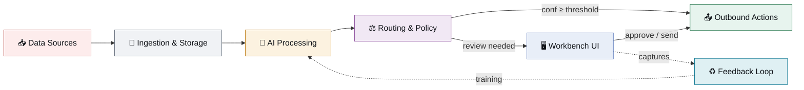
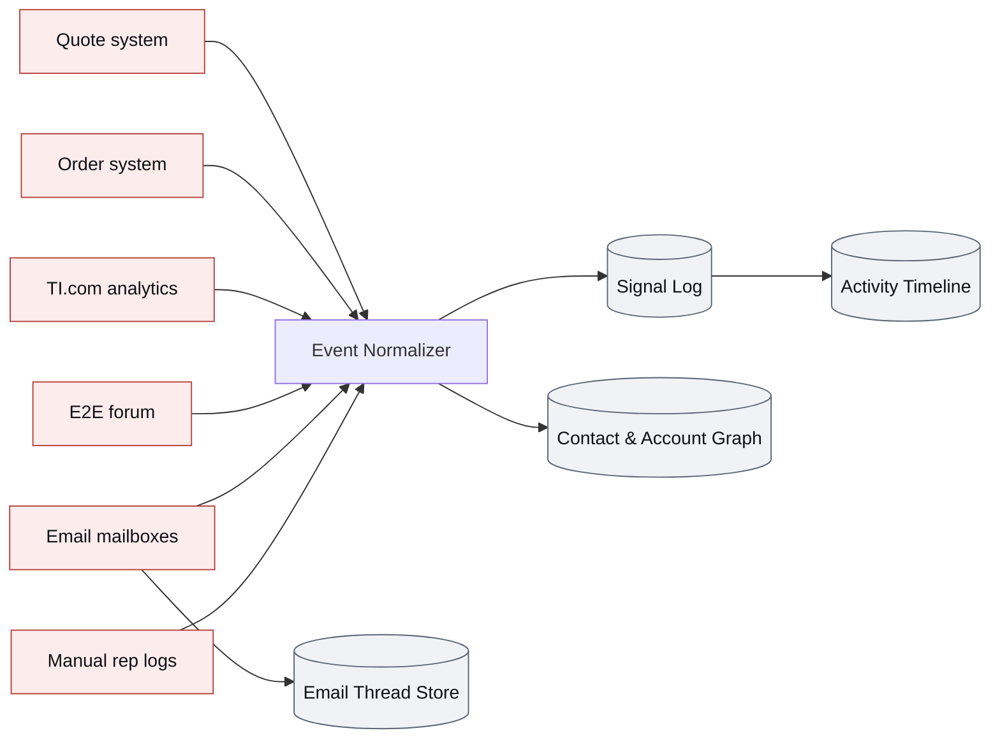
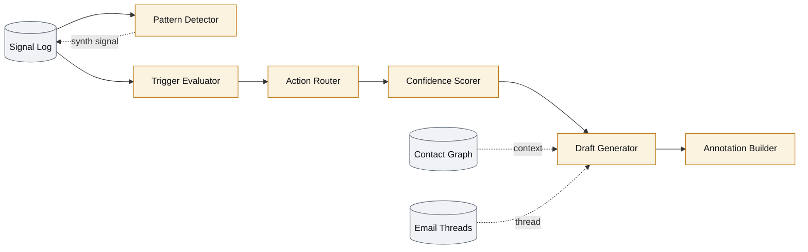
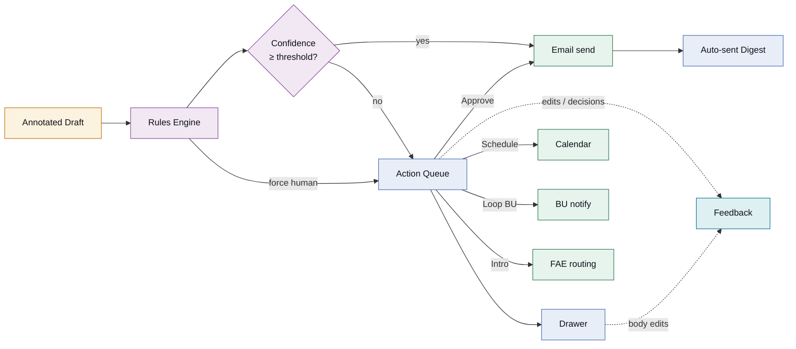
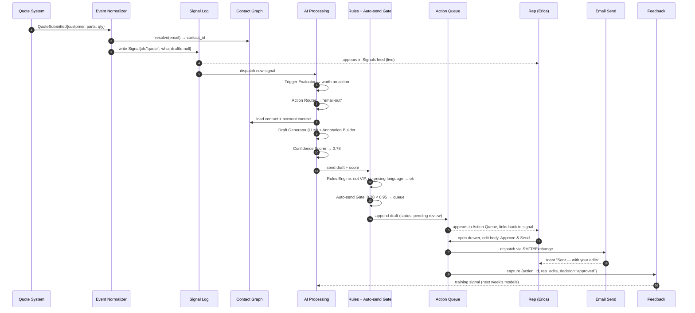

# TI Sales Workbench — Backend Architecture

This document describes the backend architecture the TI Sales Workbench *would* need to back the prototype that lives in this repo. The current prototype mocks all data in [`src/data/index.js`](../src/data/index.js); this doc describes the production system that would replace those mocks.

Audience: engineering and product partners. Use this to scope teams, services, and integrations.

---

## At a glance

- **Inputs** — customer behavior across TI properties (Quotes, Orders, TI.com, E2E), inbound email from connected mailboxes, and rep-logged activity (calls, meetings, notes).
- **Processing** — event normalization → cross-signal pattern detection → action triggering → AI draft generation → confidence-gated routing.
- **Outputs** — Signals feed (what's happening), Action Queue (what to do, why, with drafts ready to send), Drawer (rationale + sources + thread + intel), Auto-sent digest (what AI did on the rep's behalf).
- **Feedback** — every rep edit, approval, rejection, and manual override feeds the scoring + drafting models so the system learns the rep's voice and trust thresholds over time.

---

## System overview

The whole system at a glance — six logical regions plus the feedback loop.

The next three diagrams drill into each layer.

### Ingestion &amp; storage

How raw events from the seven inputs become a unified signal stream.

### AI processing

What turns signals into drafted actions.

### Routing, surfaces &amp; outbound

How drafts get to the rep, and what happens when they're approved.

### What each region does

| Region | Responsibility | Notes |
|---|---|---|
| **Data Sources** | First-party events from TI systems and connected mailboxes. | Each source publishes domain events on its own cadence (webhooks, batch exports, IMAP IDLE, message bus, etc.). |
| **Event Normalizer** | Converts heterogeneous source events into a single `Signal` schema, tags channel, resolves contact/account identity, dedupes. | Identity resolution is non-trivial — same person across email + TI.com + E2E may use different identifiers. |
| **Signal Log** | Append-only event store. Source of truth for the Signals feed and downstream processing. | Should be queryable by contact, account, channel, time range. |
| **Contact / Account Graph** | Person ↔ company ↔ relationships ↔ rep ownership. Includes attributes used to enforce policy (VIP flag, account tier). | Joins to Salesforce or whatever system of record TI uses. |
| **Email Thread Store** | Full inbound + outbound email content per contact, when the rep has granted mailbox access. | Used by the Drawer's Conversation history tab and as context for reply-draft generation. |
| **Activity Timeline** | Per-contact, time-ordered view derived from the Signal Log + Email Thread Store. | Read-optimized projection of the log. |
| **Pattern Detector** | Watches the Signal Log for multi-signal patterns ("3 engineers at Acme converged on buck regulators in 30d"). Emits synthesized `synth` signals back into the log. | Mix of heuristics and ML; runs continuously or on micro-batches. |
| **Trigger Evaluator** | Decides which signals warrant an action (vs. just being noise). Filters on signal strength, recency, account state, prior contact, rep workload. | "Did Marcus download a datasheet?" → maybe. "Did Marcus *just submit a quote*?" → almost always. |
| **Action Router** | Picks the right *type* of action: outbound email, reply, scheduled call, loop in BU, intro FAE, or human-led (no draft). | Routing rules + LLM judgment. |
| **Confidence Scorer** | Estimates probability the AI's choice + draft is correct enough to send autonomously. Calibrated with feedback signal. | Drives the auto-send gate and the row's High/Medium/Low tag. |
| **Draft Generator** | LLM produces subject, body, attachments. Pulls context from Contact Graph + Email Thread + Activity Timeline + product taxonomy. | Output includes provenance for every claim made in the draft. |
| **Annotation Builder** | Maps each phrase in the generated draft back to its source signal/document. Powers the Drawer's inline annotations + rationale rail. | Flag mismatches (e.g., AI cited the RGZ variant but order shows PW) for human review. |
| **Rules Engine** | Hard policy gates layered on top of confidence: VIP-always-human, pricing-language-always-human, account-level overrides, per-rep auto-send threshold. | Per-rep + per-account configuration; default global policy. |
| **Auto-send Gate** | If confidence ≥ threshold (default 95%) AND no policy block → send autonomously, log to digest. Otherwise → queue for review. | Threshold is per-rep tunable in the (future) Rules tab. |
| **Workbench UI** | What the rep sees: feed, queue, drawer, digest. | This is what's built in the prototype. |
| **Outbound** | Actually performs the action: email send, calendar booking, internal notification, FAE routing. | Each integration is its own service contract. |
| **Feedback Capture** | Records every rep interaction with a draft (edit, approve, reject, defer, manually-add). Streams to training pipeline. | Per the design conversation: "we can capture edits to learn from over time." |

---

## Signal lifecycle

End-to-end for a single inbound event (a customer submitting a quote):

The same shape applies to other channels — only steps 1–3 vary. Synth signals follow the same path but enter the Signal Log from the Pattern Detector instead of an external source.

---

## Data model (simplified)

| Entity | Key fields | Notes |
|---|---|---|
| `Signal` | `id, time, channel, who, company, text, draftId?, weight, `   *synth-only:* `title, body, sigCount` | Channel ∈ `quote`, `order`, `email`, `web`, `e2e`, `call` (rep-logged), `synth` (AI-derived). |
| `Contact` | `id, name, email, company, role, vip?, tags[]` | Identity hub. May map to multiple raw identifiers across sources. |
| `Account` | `id, name, tier, owner_rep, custom_rules` | Per-account policy overrides live here. |
| `EmailThread` | `id, contact_id, messages[{from, ts, subject, body}]` | Bi-directional email history. |
| `Action` | `id, rec, channel, why, subject, body, attach[], conf, action_type, model, edits?, status` | `action_type` ∈ `email-out`, `email-reply`, `call`, `loop-bu`, `intro-fae`, `human`. |
| `Annotation` | `action_id, num, kind, text, note, source` | `kind` ∈ `ok` or `flag` (mismatch detected). Links phrases to provenance. |
| `RuleSet` | `scope, conditions, force_human?, threshold_override?` | Scope = global / per-account / per-rep. |

---

## Decision points

These are the three gates the system applies between "raw signal" and "rep approves & sends":

1. **Trigger Evaluator** — should this signal produce *any* action? Most signals do not. Filters out noise (idle browsing, stale activity, signals on accounts with too-recent contact).
2. **Action Router** — *what kind* of action? Email vs. call vs. loop-BU vs. human-only. This is partly heuristic (e.g. "high-value quote on a large account → loop in BU") and partly LLM judgment.
3. **Auto-send Gate** — confidence ≥ threshold AND no policy block? If yes, send autonomously and log to the daily digest. If no, queue for rep review.

The threshold (default 95%) is tunable per rep in the Rules tab (future). VIP contacts and certain content categories (pricing, legal, complaints) are always force-human regardless of confidence.

---

## Integration requirements

What each upstream system needs to provide for this to work:

| System | Needed | Mode |
|---|---|---|
| Quote system | Quote submitted/updated/won/lost events with line items | Webhook or message bus |
| Order system | Sample/EVM order events with shipment status | Webhook |
| TI.com analytics | Page-view + asset-download events with identified user, device dedupe | Stream or batch |
| E2E forum | Post / reply events with poster identity | Webhook |
| Email (per rep mailbox) | OAuth-granted IMAP/Graph access, inbound + outbound message metadata + bodies | Per-rep auth |
| Calendar | Free/busy + booking on behalf of rep | OAuth |
| Salesforce / CRM | Contact/account graph, ownership, tier, VIP flags | Bidirectional sync |
| BU notification routing | Map of product line → BU contact | Static config or API |

---

## What's built vs. what isn't

| Layer | Status |
|---|---|
| Workbench UI (Feed, Queue, Drawer, Digest, modals, toasts) | ✅ Prototyped (this repo) |
| Mock data | ✅ In `src/data/index.js` |
| Everything else | ❌ Backend not built — this doc describes what would replace the mocks |

When backend work begins, the prototype's data shapes (in `src/data/index.js`) are a reasonable starting contract — the UI consumes exactly what's specified there.
